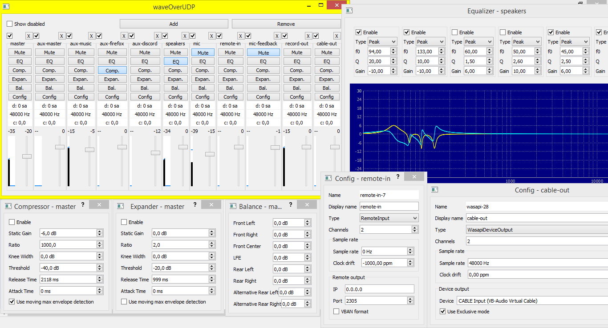
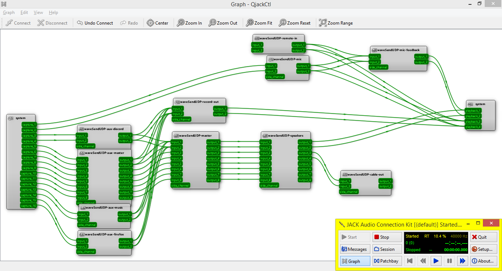
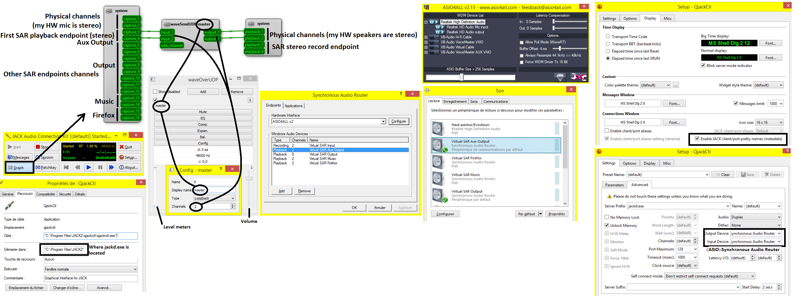

## Overview

DAMC is a audio mixing console to be used with [Jack](https://jackaudio.org/) and optionnally [SAR](https://github.com/eiz/SynchronousAudioRouter) on Windows.

## Screenshot

## Installation

Typical installation on Windows:
 - DAMC: https://github.com/amurzeau/damc/actions
 - Jack audio server: https://jackaudio.org/downloads/
 - QJackCtl with alias support for renaming audio clients: https://github.com/rncbc/qjackctl/actions?query=branch%3Amaster
 - SAR: https://github.com/eiz/SynchronousAudioRouter/releases (requires TESTSIGNING for 0.13.2, else try 0.13.1 but it might cause Jack to hang until reboot when stopping)
 - [ASIO4ALL](http://www.asio4all.org/) or [FlexASIO](https://github.com/dechamps/FlexASIO/releases) if you don't have a native ASIO driver for your soundcard

Steps to use DAMC:

1. First install [Jack (1.9.20+)](https://jackaudio.org/downloads/) to its default path. Also select the bundled QJackCtl.
2. Install ASIO4ALL or FlexASIO if you don't already have an ASIO driver for your audio soundcard
3. If you plan to use SAR 0.13.2, enable TESTSIGNING **and reboot**: see more details here: https://github.com/eiz/SynchronousAudioRouter/releases
4. Install SAR
5. Configure SAR:
   1. If with 0.13.2: use `SAR Configuration` tool to configure SAR
   2. Else use [asioconfig](https://github.com/jprjr/asioconfig)
   3. In SAR configuration:
      1. Select the appropriate ASIO Hardware interface and configure it too
      2. Add some playback / record endpoints
6. Start QJackCtl
7. Configure settings in QJackCtl:
   1. In Settings -> Advanced tab: Set both `Output Device` and `Input Device` to `ASIO::Synchronous Audio Router`
   2. In Display tab: check `Enable JACK client/port prety-names (metadata)`

8. In QJackCtl, click on the `Start` button, this should start jack
9. Run DAMC server and gui:
   - `damc_server.exe`
   - `damc_gui.exe`
10. In the DAMC GUI, click Add button to add a Jack client that can receive/send audio
   - Each jack client managed by DAMC do this:
     - Receive audio from other Jack clients or from various external sources (configured by `type`)
	 - Do processing on the audio stream (like volume, mute, compressor)
	 - Output audio to other Jack clients or to external sinks (configured by `type`)
11. In the config dialog box, configure things:
   - Display Name: name shown in QJackCtl and in DAMC GUI
   - Type:
      - Loopback: received audio is send on its outputs through enabled filters
	  - RemoteOutput: received audio is sent on the network using UDP to specified target IP / port address. VBAN format is required to be compatible with Voicemeeter.
	  - RemoteInput: receive audio from the network by listening on specified IP / port for incoming UDP packets and send it to jack client's outputs.
	  - DeviceOutput: received audio is sent to specified device. The device is managed using Portaudio.
	  - DeviceInput: audio is capture from specified device using Portaudio.
	  - WasapiDeviceOutput: received audio is sent to specified device. The device is managed using WASAPI.
	  - WasapiDeviceInput: audio is capture from specified device using WASAPI.
   - Channels: the number of channel this jack client must handle (for example: 2 for stereo audio)
   - Sample rate:
     - Sample rate: the sample rate of the external portaudio / WASAPI device or the remote UDP endpoint
     - Clock drift: adjust the sample rate clock drift in PPM (part per million)
   - Remote output:
     - IP / Port :
	   - With RemoteOutput: the target IP / Port which will receive audio over UDP
	   - With RemoteInput: the IP / Port to bind to listen for incoming audio UDP packets
	 - VBAN format: use Voicemeeter packet format
   - Device output:
     - Device: The external device to send / receive audio
	 - Use Exclusive mode: use exclusive WASAPI mode (can be used with Portaudio too when using a WASAPI device)
12. In QJackCtl, click the `Graph` button and connect jack clients together:
   - Suppose you have this configuration:
     - SAR use a Hardware interface with a single stereo mic (= 2 physical channels)
	 - SAR is configured with 1 playback endpoint with 2 channels (= 2 virtual channels)
   - Then in QJackCtl, system has 4 output channels:
     - capture_1 and capture_2 are the 2 physical channels
	 - capture_3 and capture_4 are the 2 logical channels
   - So to do virtual endpoint => DAMC => physical speakers, connect them like this:
     - Connect capture_3 and capture_4 to DAMC client's inputs
	 - Connect DAMC client's outputs to system's playback_1 and playback_2

Here is the global configuration for this example:

## Additional information

As DAMC uses Jack audio server, you can use other tools that use Jack too.
For example, with [Carla](https://github.com/falkTX/Carla), you can use VST plugins.

## Known issues

1. On Windows, when disabling / enabling a jack client, sometimes Jack "hang" while the audio still runs fine, for example changing the volume has no effect.
If this happens, you need to kill the DAMC server with CTRL+C in its console and restart it.
